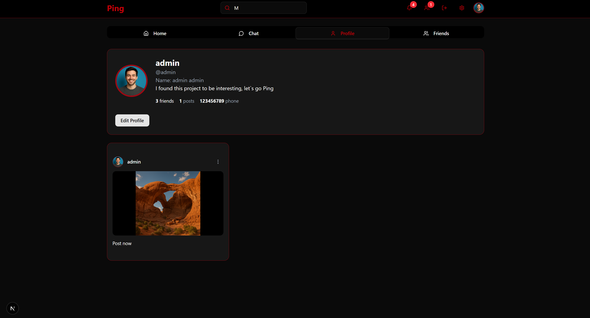

---

# 📱Ping
Ping is a social media application that offers real-time messaging (both private and group conversations) with live updates via WebSocket, comprehensive friend management (including requests, acceptances, and suggestions), the ability to create and view posts with text, images, comments, and likes, a personalized feed based on friends' activity, and real-time notifications for important interactions such as new posts, comments, or friend requests.

## 🌐 Methods
| Module        | Short Description             |
|---------------|-------------------------------|
| Auth          | 📧📱 Email/Phone verification  |
| Auth          | 🔐 User login                 |
| Auth          | 📝 User registration          |
| Auth          | 🔑 Password recovery          |
| Auth          | 📲 Phone verification code    |
| Auth          | ♻️ Password reset             |
| Profile       | 👤 User details               |
| User Search   | 🔍 Search users               |
| Friends       | 🤝 Send friend request        |
| Posts         | 📝 User posts                 |
| Profile       | ✏️ Update profile             |
| Friends       | ✅ Accepted friends           |
| Profile       | 📤🖼️ Upload profile picture   |
| Profile       | 🗑️🖼️ Delete profile picture  |
| Posts         | 🗑️ Delete post                |
| Friends       | ❌🤝 Delete friendship         |
| Chat          | 💬 User conversations         |
| Chat          | 📄💬 Conversation details     |
| Chat          | 📩 Send message               |
| Chat          | 🔒💬 Create private chat      |
| Chat          | 👥💬 Create group             |
| Chat          | 🗑️💬 Delete conversation     |
| Friends       | ⏳🤝 Pending requests          |
| Friends       | 📬 Respond to request         |
| Friends       | 🧠🤝 Suggested friends         |
| Notifications | 🔔 Unread notifications       |
| Notifications | ✔️🔔 Mark as read             |
| Notifications | 🗑️🔔 Delete notification      |
| Posts         | 📰 Personalized feed          |
| Comments      | 💬📝 Post comments            |
| Comments      | ➕💬 Add comment              |
| Posts         | ➕📝 Create post              |
| Posts         | ❤️/💔 Like/Unlike post        |
| Posts         | 👍 Liked posts                |
| Posts         | 🔢❤️ Number of likes         |
| Admin         | 👥 All users                  |
| Admin         | 🔎👤 Search by last name      |
| Admin         | 🔎🧑 Search by first name     |
| Admin         | 🔎📱 Search by phone          |
| Admin         | ➕🎭 Create role              |
| Admin         | 🗑️🎭 Delete role             |
| Admin         | 🎯 Assign role                |
| Admin         | 🚫🎯 Unassign role            |
| Admin         | 🗑️👤 Delete user             |

📡 Kafka Topics

- `post-add-event` → notifies friends about a new post  
- `comment-event` → notifies the post author about new comments  
- `friend-request-event` → notifies users about new friend requests  

🔔 WebSocket Channels

- `/topic/conversations/{conversationId}` – real-time messaging between users  
- `/topic/notifications/{username}` – real-time notifications (posts, comments, friend requests)  
- `/topic/update-picture/{username}` – updates their profile picture in real time 
- `/topic/update-info/{username}` – updates their profile information in real time 
- `/topic/friends/{username}` – notify user in real time when they receive a friend request  

🎨 Principal Pages

- `/auth/register`, `/auth/login`, `/auth/forgot-password`, `/auth/reset-password` – Authentication routes  
- `/social` – Main page (with Tabs: Feed, Friends, Chat, Profile)  
- `FeedTab.tsx` – displays posts from friends  
- `ChatTab.tsx` – conversations & real-time messaging (WebSocket)  
- `FriendsTab.tsx` – friend suggestions and requests  
- `ProfileTab.tsx` – edit profile and view your own posts  
- `NotificationsDialog.tsx` – displays real-time notifications  
- `FriendsDialog.tsx` – manage incoming and outgoing friend requests

📸 Screenshots

| SS1.png | SS2.png | SS3.png |
|--------|---------|---------|
|  |  |  |

| SS4.png | SS5.png | SS6.png |
|--------|---------|---------|
|  |  |  |

| SS7.png | SS8.png | SS9.png |
|--------|---------|---------|
|  |  |  |

| SS10.png | SS11.png | SS12.png |
|----------|----------|-----------|
|  |  |  |

| SS13.png | SS14.png | SS15.png |
|----------|----------|-----------|
|  |  |  |

| SS16.png | SS17.png | SS18.png |
|----------|----------|-----------|
|  |  |  |

| SS19.png | SS20.png | SS21.png |
|----------|----------|-----------|
|  |  |  |

| SS22.png | SS23.png | SS24.png |
|----------|----------|-----------|
|  |  |  |

| SS25.png |
|----------|
| |

